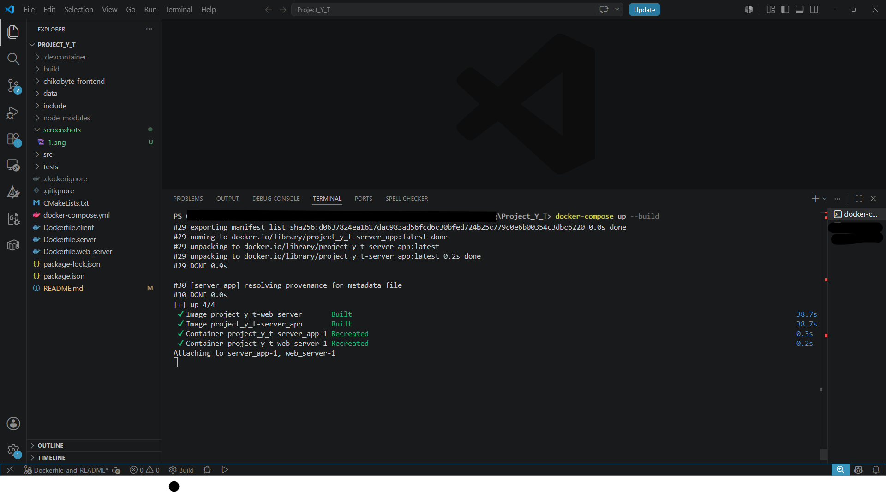
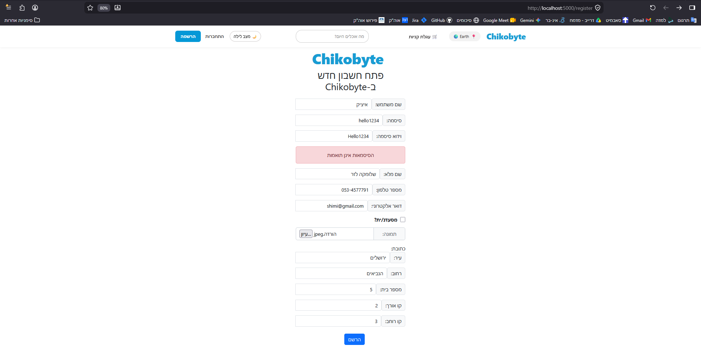
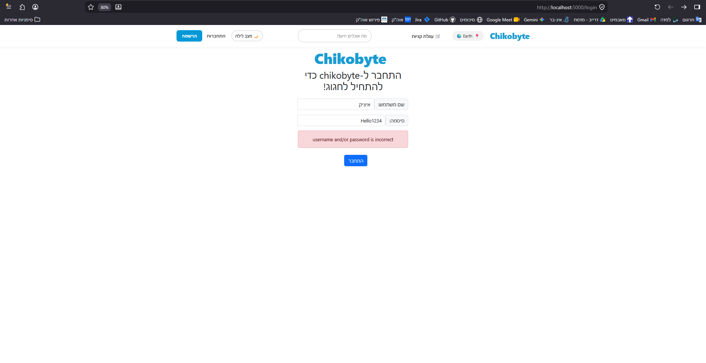
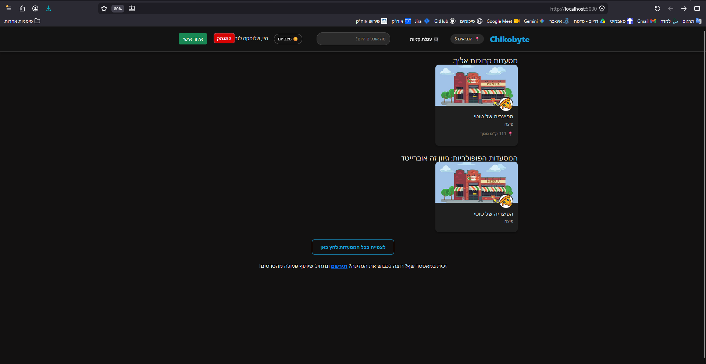
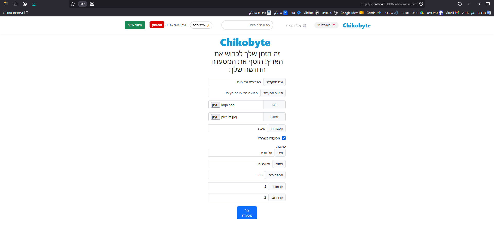
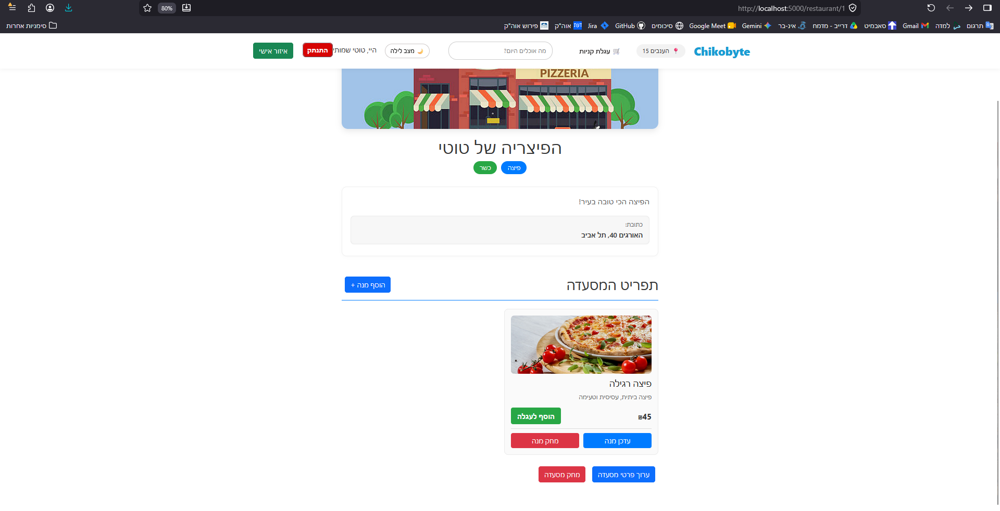
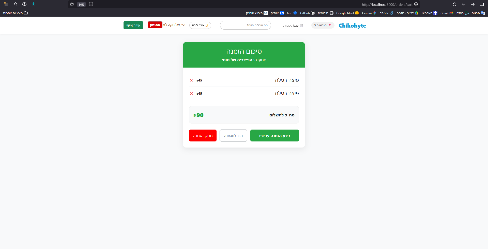
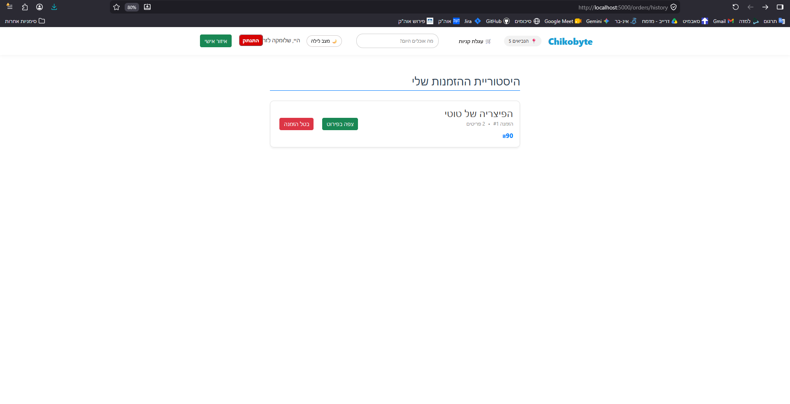
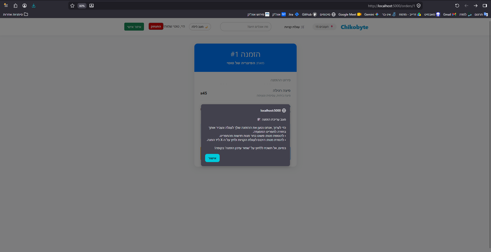

# Food Delivery Platform - Advanced System Programming

Welcome to the final submission of the Food Delivery Platform project. This application simulates a real-world food delivery service (inspired by platforms like Wolt), featuring a complete frontend, a robust backend, and an intelligent C++ recommender system.

## Repository Structure & Submissions
Please note that the submissions for all exercises in this course are organized into dedicated branches. 
You can find the specific states of the project for each exercise in the following branches:
* `Ex1-submission`
* `Ex2-submission`
* `Ex3-submission`
* `Ex4-submission` (Current)

## Project Architecture
The project is built using a modern, containerized microservices architecture:
* **Frontend (`chikobyte-frontend`):** A dynamic, responsive React single-page application (SPA). It uses Context API for state management, React Router for navigation, and dynamic theming (Dark/Light mode).
* **Web Server (`web_server`):** A Node.js/Express RESTful API that handles user authentication (JWT), business logic, and database interactions. In production mode, it also serves the compiled static React files.
* **Core Backend (`server_app`):** A high-performance C++ application handling heavy computations and real-time TCP socket communications.

---

## How to Compile and Run the Project

We use Docker and Docker Compose to containerize the environments, ensuring seamless compilation and execution without manual dependency management. 

### Prerequisites
* Docker Desktop installed and running.
* Git for cloning the repository.

### Execution Steps
1. Open your terminal and navigate to the root directory of the project.
2. Run the following command to build the images and start the containers:
   ```bash
   docker-compose up --build
> **Note on Compilation:** The `web_server` uses a **Docker Multi-stage Build**. During the build process, Docker first creates a Node environment to automatically run `npm install` and `npm run build` for the React frontend. It then copies ONLY the final minimized static files (`/build`) into the Express server container. This ensures optimal performance and security.

3. Wait for the containers to initialize. You should see logs indicating the C++ server and Node.js server are listening.
4. Open your web browser and navigate to: **`http://localhost:5000`**



---

## 📖 User Manual & App Walkthrough

### 1. Authentication (Login & Registration)
To interact with the platform, users must authenticate. 
* **Registration:** New users can sign up by providing their details, including a profile picture and a secure password (enforced by strict validation).
* **Login:** Returning users log in to receive a JWT token, which is securely used for all subsequent API calls.




### 2. Home Page & Discovery
Once logged in, the user lands on the main dashboard. 
* Here, users can browse available restaurants fetched dynamically from the server.
* **Theme Toggle:** Users can switch between Light and Dark modes using the toggle in the top navigation bar.



### 3. Restaurant Owner Panel (Admin Exclusives)
Users registered as Restaurant Owners gain access to dedicated management features:
* **Create Restaurant:** Owners can open a new restaurant by clicking in a specified button in the home page, defining its name, category, and address details.
* **Edit Restaurant:** Owners can dynamically update their existing restaurant's information.
* **Menu Management:** * **Add Products:** Owners can add new dishes to their restaurant's menu, specifying the price, description, and an image.
  * **Edit Products:** Modify existing product details (such as updating prices or descriptions).
  * **Delete Products:** Permanently remove items from the menu.




### 4. Placing an Order
* Click on a restaurant to view its full menu.
* Add items to your cart. The system prevents adding items from multiple restaurants simultaneously.
* Navigate to the Checkout page to review the total price and place the order.



### 5. Order History & Editing
Users can view their past and active orders through the Order History page. 
* **Edit Flow:** We implemented a seamless editing experience. By clicking "Edit Order", the original items are loaded back into the active cart, and the user is navigated back to the restaurant's menu. 
* Users can add new items, or remove existing ones directly from the checkout cart.
* Submitting the edited cart updates the existing order in the database via a `PATCH` request.





---
**Developed for Advanced System Programming - Exercise 4**