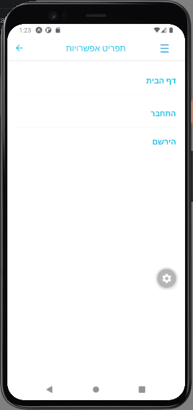
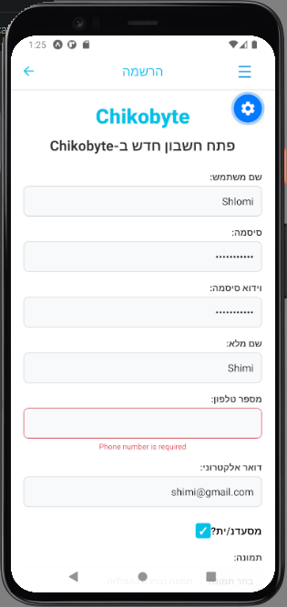
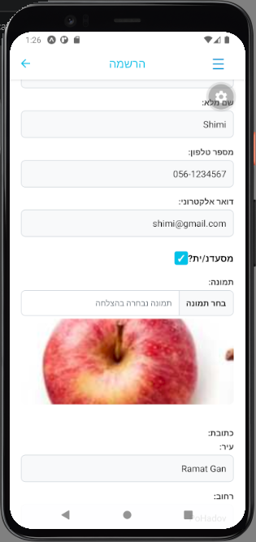
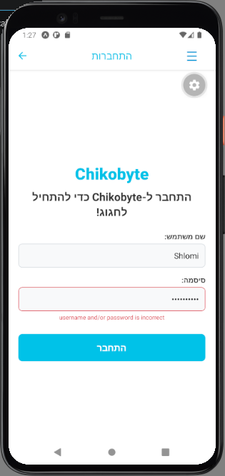
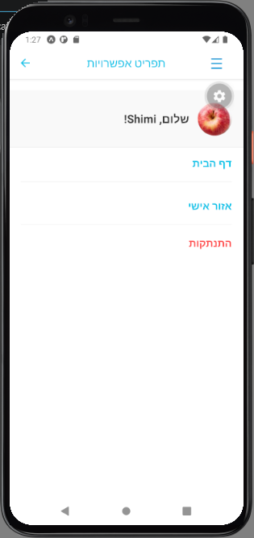

# 2. Authentication (Registration & Login) 

Chikobyte features a complete authentication system utilizing JWT (JSON Web Tokens) to secure user sessions and personalize the experience. 

## User Registration
To order food and manage a cart, users must create a personal account. The registration form implements strict client-side and server-side validations.

1. Navigate to the **Register** screen from the Home screen.

<td></td>

2. Fill in the required details:
   * **Validations enforced:** All fields are mandatory. 
   * **Password Rules:** The password must be at least 8 characters long and contain a combination of letters and numbers.
   * **Visual Feedback:** If the user enters invalid data (e.g., a weak password or missing fields), clear visual error messages are displayed on the screen, and the form cannot be submitted.
3. **Profile Picture:** The user can select a profile picture directly from their phone's gallery (converted to Base64 format). The selected image is previewed dynamically on the screen before submission.
4. Click "Register". Upon success, the user is created in MongoDB, automatically logged in, and redirected to the Home screen.
<table>
  <tr>
    <td><b>register - failure</b></td>
    <td><b>register - full details</b></td>
  </tr>
  <tr>
    <td></td>
    <td></td>
  </tr>
</table>

---

## User Login
Returning users can log in using their credentials to retrieve their token and access authorized features.

1. Navigate to the **Login** screen.
2. Enter the registered email and password.
3. **Error Handling:** If incorrect details are provided (or if the user does not exist), the server returns an appropriate error, which is displayed clearly to the user.
4. Upon successful login, the JWT token is saved locally, and the user gains access to the application.

<table>
  <tr>
    <td><b>login - failure</b></td>
    <td><b>login - success</b></td>
  </tr>
  <tr>
    <td></td>
    <td></td>
  </tr>
</table>

---

## User Profile
Once authenticated, users can view their personal details to confirm their active session.

1. Open the application's navigation menu.
2. Navigate to the **Profile** screen.
3. The screen displays the user's real name, email, phone number, physical address, and the profile picture they uploaded during registration. This confirms that the global user state is correctly populated across the application.

  

---

## Logout functionality
The application provides a seamless way to log out, ensuring user privacy.

1. Once logged in, the user can access the Menu (☰) and click **Logout**.
2. This action clears the saved JWT token and user state from the Context API.
3. The user is instantly redirected back to the Login screen and disconnected from the application.

<td></td>

