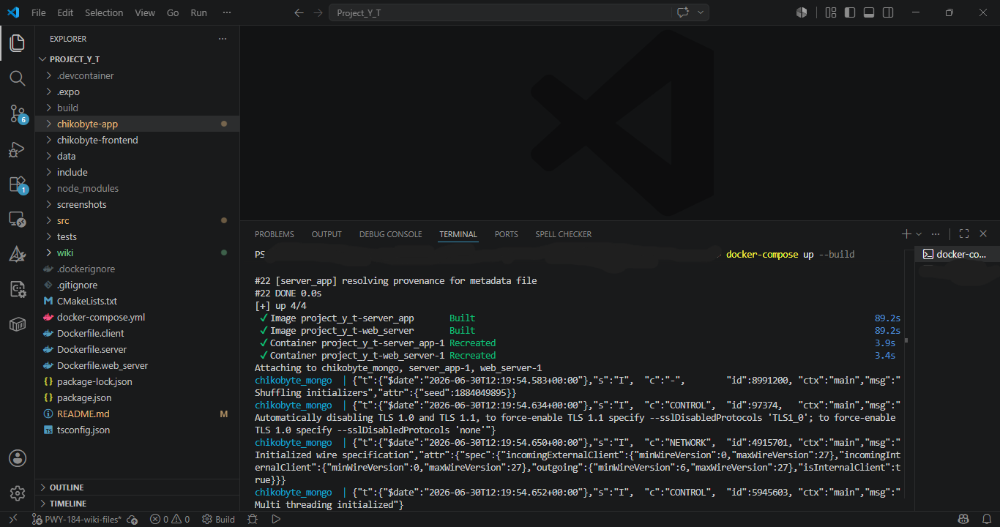
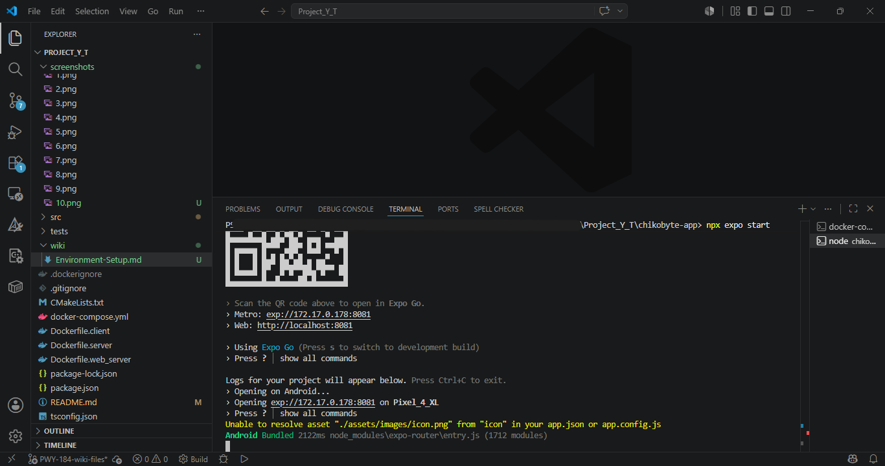

# 1. Environment Setup & Execution 

This guide covers the complete process of compiling, configuring, and running the Chikobyte platform. The system utilizes Docker Compose for the backend services and Expo for the React Native mobile frontend.

## Prerequisites
Before you begin, ensure you have the following software installed:
* **Docker Desktop** (running in the background)
* **Node.js** (v18 or higher)
* **Expo Go** application installed on your physical mobile device.

---

## Step 1: Running the Backend Services
The backend infrastructure (MongoDB, Node.js Web Server, and C++ TCP Server) is fully containerized for a seamless setup.

1. Open a terminal and navigate to the root directory of the project.
2. Run the following command to build the images and start all containers:
   ```bash
   docker-compose up --build
   ```
   Wait until you see the terminal logs confirming that MongoDB is connected, the C++ TCP server is ready, and the Node.js Web Server is listening on port 5000.



---

## Step 2: Network Configuration (Pre-configured)
Since the React Native application is intended to run on an Android Emulator for testing, the frontend is already pre-configured to route traffic to the host machine's local Docker server. 

The API URL in `chikobyte-app/app/config/apiConfig.ts` is set to use the Android Emulator's default loopback IP (`10.0.2.2`). No additional network configuration is required on your end.

---

## Step 3: Running the Mobile App
With the backend running, we can now launch the frontend.

1. Open a **new** terminal window (leave the Docker terminal running in the background).
2. Navigate to the frontend directory:
   ```bash
   cd chikobyte-app
   ```
3. Install the required npm packages (only required the first time):
   ```bash
   npm install
   ```
4. Start the Expo development server:
   ```bash
   npx expo start
   ```

---

## Step 4: Connecting with the Android Emulator
1. Ensure your Android Emulator (e.g., via Android Studio) is up and running in the background.
2. In the terminal where the Expo server is running, press the `a` key on your keyboard.
3. Expo will automatically install the Expo Go client on the emulator, bundle the JavaScript code, and launch the Chikobyte application.




---

## Step 5: Verification
1. Ensure the app loads in the emulator without any network errors.
2. Verify that the initial seeded restaurants ("Chiko Burger" and "Sushi Ninja") are visible on the home screen, confirming that the frontend is successfully communicating with the Dockerized backend and MongoDB database.

<p align="center">
<td></td>
</p>
