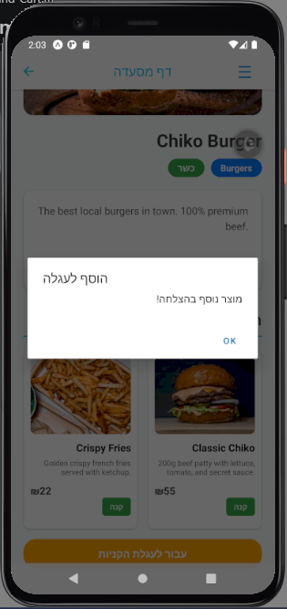
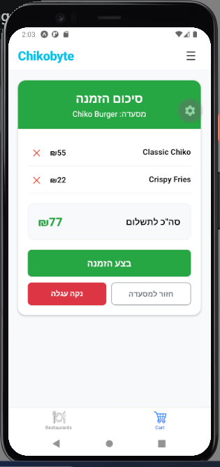
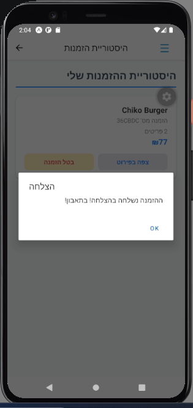
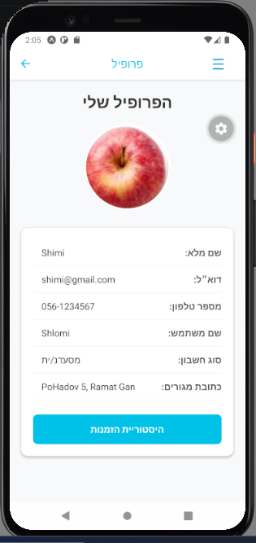
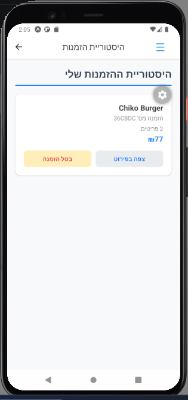
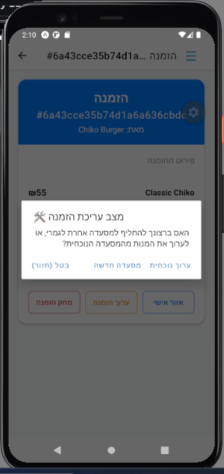
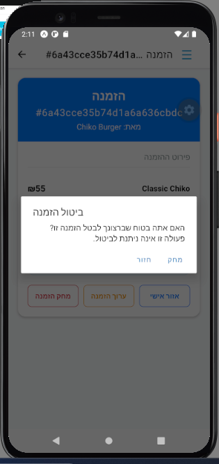

# 5. Orders & Cart

The core functionality of Chikobyte revolves around a seamless and secure ordering experience. The platform utilizes React's Context API to manage the user's selected items globally across the application.

## Cart Management
Authenticated users can seamlessly add products to their cart directly from any restaurant's menu. 

* **State Management:** Adding or removing items updates the global cart state immediately without requiring unnecessary network requests.
* **Reviewing the Cart:** The dedicated Cart screen displays a summary of all selected items, including their names, individual prices, and the specific restaurant they belong to.
* **Dynamic Pricing:** The system accurately calculates and updates the total final price in real-time. It effectively handles the removal of items, ensuring the total cost is always perfectly synchronized with the cart's contents.

<table>
  <tr>
    <td><b>Adding to Cart (Menu)</b></td>
    <td><b>Active Cart View</b></td>
  </tr>
  <tr>
    <td></td>
    <td></td>
  </tr>
</table>

---

## Checkout Process
Once the user is satisfied with their selection, the checkout process securely transmits the data to the backend infrastructure.

1. The user reviews the final total and clicks the checkout/place order button.
2. A validated request containing the cart items, the total price, and the user's ID is sent to the Node.js API.
3. The server validates the request and creates a new `Order` document in MongoDB, linking its reference to the user's `orders` array.
4. Upon a successful server response, the user receives a native confirmation alert. The local cart state is immediately cleared, and the user is redirected safely back to the Home screen.

  

## Order History (Profile)
To provide a complete user experience, the application allows users to review their past activity.

* By navigating to the personal profile or order history section, the application queries the database for all previous orders associated with the authenticated user's token.
* The history displays the relevant details of past transactions, confirming that the data is persistently stored and correctly linked in the database.

<table>
  <tr>
    <td><b>Orders History Button</b></td>
    <td><b>Orders History Page</b></td>
  </tr>
  <tr>
    <td></td>
    <td></td>
  </tr>
</table>

---

## Managing Active Orders (Update & Delete)
Users maintain control over their orders even after the checkout process, through the order page accessible from the orders history page. 

* **Updating an Order:** Users can modify their active orders (e.g., adding or removing products). Submitting an update sends a request to the server, which recalculates the total price and updates the existing MongoDB document accordingly.
* **Canceling/Deleting an Order:** Users can cancel an active order entirely. This action requires passing a native confirmation prompt. Once confirmed, a delete request is dispatched to the server, securely removing the order document from the database and unlinking it from the user's account.

<table>
  <tr>
    <td><b>Updating an Order</b></td>
    <td><b>Cancel Order Confirmation</b></td>
  </tr>
  <tr>
    <td></td>
    <td></td>
  </tr>
</table>

---