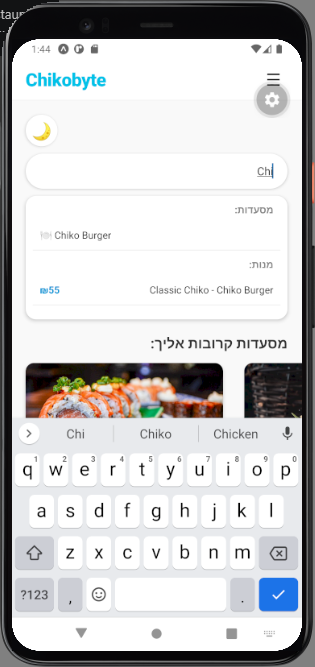
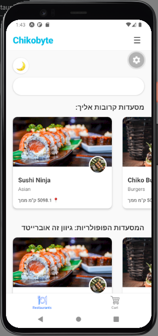
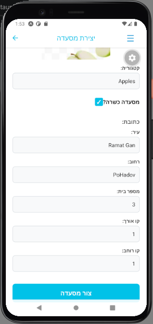
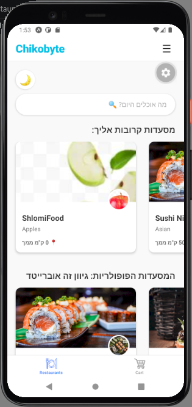
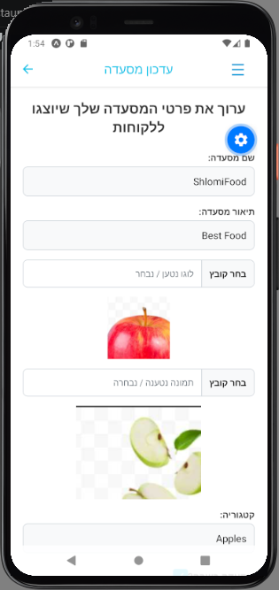
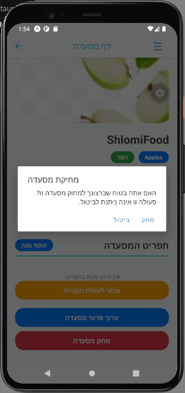

# 3. Restaurant Management

The Chikobyte platform allows users to browse and search for restaurants, while providing administrative users with full CRUD (Create, Read, Update, Delete) capabilities.

## Viewing and Searching Restaurants
Any user (guest or registered) can view the available restaurants.

* **Home Screen:** Displays categorized lists such as "Popular" and "Nearby" restaurants.
* **Search Functionality:** Users can use the top search bar to instantly find restaurants or specific menu items. The search implements a 500ms debounce mechanism to ensure smooth mobile performance and prevent keyboard lag without overloading the Node.js server.

<table>
  <tr>
    <td><b>
Search Results
</b></td>
    <td><b>
Home Page
</b></td>
  </tr>
  <tr>
    <td></td>
    <td></td>
  </tr>
</table>

---

## Creating a Restaurant (Admin/Owner)
Users with administrative privileges can add new restaurants to the platform.

1. Log in with an Admin account.
2. Navigate to the **Create Restaurant** dedicated screen.
3. Fill out the required details (Name, Category, Description, Address, Kosher status).
4. Upload a Main Image and a Logo (processed as Base64 strings).
5. Submit the form. The new restaurant is immediately saved to the MongoDB database and visible on the platform.

<table>
  <tr>
    <td><b>
Create Form
</b></td>
    <td><b>
Restaurant Created!
</b></td>
  </tr>
  <tr>
    <td></td>
    <td></td>
  </tr>
</table>

---

## Updating and Deleting a Restaurant
Owners have full control to modify or remove their existing restaurants directly from the mobile app.

* **Updating:** From the specific Restaurant Page, the owner can click the update button to change the description, address, or upload new images.
* **Deleting:** The owner can permanently delete the restaurant. A native confirmation dialogue (Alert) prevents accidental deletions. Once confirmed, the restaurant and all its associated products are securely removed from the database.

<table>
  <tr>
    <td><b>
Update Restaurant Form
</b></td>
    <td><b>
Delete Confirmation Alert
</b></td>
  </tr>
  <tr>
    <td></td>
    <td></td>
  </tr>
</table>